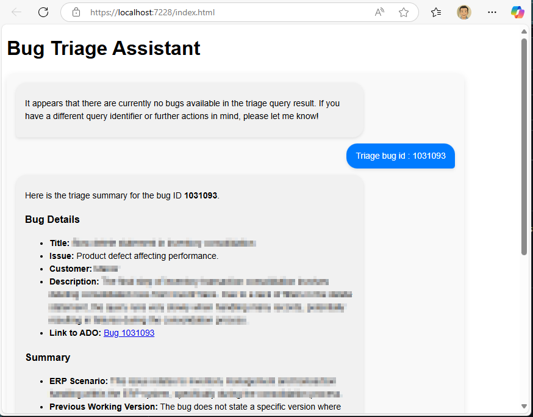
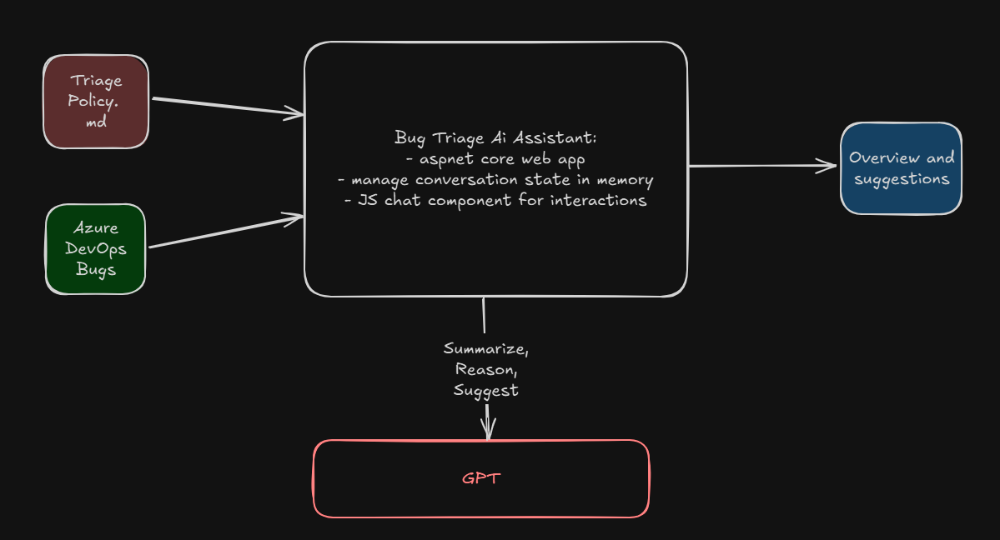

# ado-bugtriage-aiassistant

## About
The goal of the project is to accelerate work related to bug triage. The tool is processing bug reports from the support channel, looking to structure the information in familiar way, and give suggestions from organization's triage policy.

## How to use

> You need an Azure AI Foundry instance with a model deployed.
> You need an Azure DevOps instance.

1. Enter `ado` and `openAiClient` details in the `appsettings.json` file.
1. Execute `az login` and log in. The tool by default is using Default Azure Credentials, inferring necessary secrets from the context of your environment.
1. Run the project in Visual Studio.

For brevity, the tool will launch assuming you want to triage all items in the query. You can continue the conversation by specifying different query id or work item id.

## Design, implementation and learning in the project

- The project was meant to learn basic components of an AI-enabled system (GPT API, memory management, prompting), that are otherwise abstracted by an agent framework, MCS servers etc
- The project is meant to experience AI-powered development with GitHub Copilot and ChatGPT

## Next steps

The main challenge in the project is non-deterministic behavior of the model. The model summarizes differently and reasons differently about severity of the bug per each invocation on the same input information. Further learning in prompting and grounding techniques required.