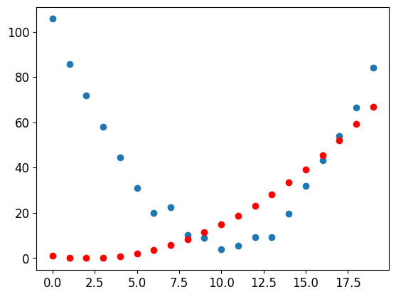
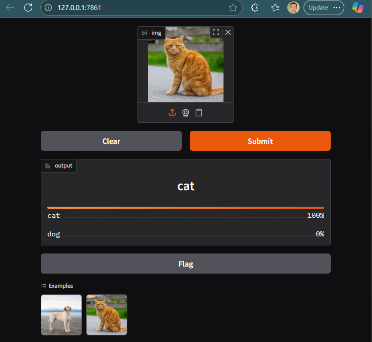
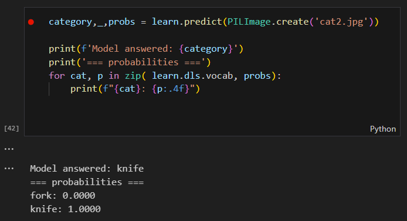

# Notes from the FastAI course

This project is built along taking the [FastAI Course](https://course.fast.ai/). Based on prior experience, using websearch may be problematic on Kaggle, Colab and similar.

## Chapters

### 1.8 Convoluted NN
[Jupyter](1.8/convolutions.ipynb)
MNIST dataset and digits recognition.

The idea of a `convolution` is transforming input image with a small kernel matrix (e.g. 3x3). The kernel matrix is often constrained, e.g. requiring some 0s, or tying values. The network will be learning parameters of the convolution. Simple kernels can be good at detecting edges, gradients, corners etc.

The NN architecture is a series of connected convolutions.
The design used reductive convolutions (stride=2), producing a quarter of the picture in the output, and to compensate for information reduction over layers (fewer multiplications) we are doubling channels per layer.

In attempt to scale this model up to full 10 digits, the learning blew up (diverged), showing practical instabilities of NN training related to adapting layers continuously confusing subsequent layers.
Used the FastAI callbacks collecting statistics from training (near-zero activations, color-histogram).

The problem is addressed with `batchnorm` (Batch Normalization) - which is centering the mean to 0, and dividing to achieve var 1, per batch.
This stabilizes learning and permits higher LR, and random starting parameters. Resulting in a "healthy" histogram of smoothly increasing non-zero activations.

### 1.7 Collaborative filtering
[Jupyter](1.7/collaborative_filtering.ipynb)

- Prepared the MovieLense dataset (reviews), in small 100k version
- Built user and movie embeddings - conceptually table lookups, mathematically a one-hot-vectors, technically implemented as table lookups with a trick for correct gradient calculation. 

#### DotProduct 
- DotProductModel = (UserEmb * MovieEmb).sum(), MSE (embeddings must match on vector size)
- Intuitive bias parameter interpretation
- PCA (Principal Component Analysis) method, to reduce high-dimensional matrix of parameters into 2D or 3D matrix (collapsing dimensions while preserving information) giving human opportunity to see and interpret results.
- Bootstraping problem and biased representation problem
- Weight-decay technique - friction in gradient for smoother training.

#### Embeddings with NeuralNetwork
- Instead of dot-product on factors, we can just chuck embeddiings into 1st layer of a deep learning NN.
- No need for embeddings size compatibility, because we concatanete [batch_size x emb1_size + emb2_size]
- NN is a flexible model, we can add other things into NN, while dot-product is more tailored.

### 1.6 Decision Trees & Paddy Comp (rice disease)

#### Paddy Competition
[Paddy Doctor: Paddy Disease Classification](https://www.kaggle.com/competitions/paddy-disease-classification/overview)
[Jupyter](1.6/road-to-the-top.ipynb)

Based on a 3-part series :
 - [Part 1 - basic comp setup with image trainer](https://www.kaggle.com/code/jhoward/first-steps-road-to-the-top-part-1)
 - [Part 2 - fast, iterative approach to imprving image trainer](https://www.kaggle.com/code/jhoward/small-models-road-to-the-top-part-2/)
 - [Part 3 - scaling up the best setup](https://www.kaggle.com/code/jhoward/finishing-off-road-to-the-top-part-3)

The score is 98.346% on convnext.large model, ~15th percentile.

Take-aways:
 - Magic knowledge: know good vision models. [The best vision models for fine-tuning](https://www.kaggle.com/code/jhoward/the-best-vision-models-for-fine-tuning)
 - FastAI library encapsulates tooling for fiddling the input test data to push model to better training. Key knobs:
   - Resizing input images with cropping strategies
   - Further down-sizing the images in micro-batches with random cropping, distortion, lighting changes, flips, zooms
   - Memory savings with Gradient Accumulation
- Test-Time Augmentation (TTA) for higher inference cost
    - Small distortions to test set and average the results 
    - Bagging/Ensembling models
- Scaling up to larger models trades for time or money. My RTX 3000 laptop takes ~1h to train 10 epochs of a larger model, while server-grade GPUs are 10-100-1000x faster. I've used managed `L40s` GPUs  from Lightning.AI to have tolerable learning loops.
- High cost of the last 1% of improvement.
 

#### Decision Trees
[Jupyter](1.6/trees.ipynb)

1. Practicing fundamentals of Decision Trees - OneR classifier
1. Building Trees and Forrests - trivial with sklearn

Take-aways:
- Neat built-in feature for `feature importanc`e to reduce the feature space in analysis
- Random Forests are hard to mess up, cheap to train, and eat training data before cleaning. Great start to analysis of tabular data.

### 1.5 Advancing linear to Neural Net, to deep Neural Net
[Jupyter](1.5/titanic.ipynb)

#### Data preparation and feature engineering

1. Download Titanic dataset from kaggle competition
1. Load dataframe and analyze with `isNa()`, `describe()`, `info()`
1. isNa analysis: replacing Nas with `mode()` -> data interpolation
1. Long-tailed `Fare` attribute analysis with `hist()` -> `logp1` to reduce distribution
1. Categorical attributes (e.g. boarded in) are exploded to binary variables using `get_dummies()`
1. Project only resulting columns, force as float, and normalize by dividing with max value per column

Results is a pytorch rank-2 tensor representing the input data.

#### Preparing 3 models: linear, NN and Deep-NN

The model can be thought of as an interface implementation of:
 - init_coefficients()  -> returns grad-enabled represntation of model variables
 - calc_predictions(coefficients, training input)  -> applies coefficients on training input, producing an **actual** result
 - calc_loss(coefficients, training input, expected results) -> calculates predictions and measures distance to **expected** result. We're using MAE (mean abs error)
 - update_coefficients(coefficients, learning_rate)  ->  apply gradients on coefficients in propotion to LR
 - (optional) show_coefficients -> in linear we can still track what's going on, later it's getting tough

##### Linear
Linear model implements the above as producing a vector of coeffs, and simply multiplies the input data through it. It wraps the result in Sigmoid - clamps output between (0, 1).

##### NN
NN-model adds in a layer in between input coefficients and output. There are 2 matrix multiplications. First is wrapped in ReLU (zero the negative values), second wrapped in Sigmoid

##### Deep-NN
Deep-NN-model has 2 layers in between. All but last layer is ReLU-ed, last layer is Sigmoid-ed.

#### Take-aways

- There are inconsistencies in course material that led me to 2 fails in training models. **Make sure to zero the gradients**, and **normalize the numeric data, removing bias from data**.
- In this tabular data problem, the Deep NN achieved the best fit, the linear was a close 2nd, and I had the most challenges fiddling with the single-layer NN.
- With some fiddling of parameters of this vanilla model I achieved loss of 0.19, and accuracy of 83%. Kaggle submission had 77% accuracy, placing me on the 27th percentile of the competition.

### 1.3 Neural Networks from Scratch - Stochastic Gradient Descent
[Jupyter](1.3/SGD.ipynb)

1. Went through building a linear model from scratch, using pure PyTorch tensors and operations. The model was fitting a quadratic function on generated data.
1. Built a 95% accurate model differentiating between 3s and 7s from MNIST dataset.
1. Coded raw PyTorch, then wrapped in fastai Learners, one with Linear model, one with simple neural network (1 hidden layer of 30 neurons with ReLU).

### 1.2 Deploying
[Jupyter](1.2/dogs_cats.ipynb)

1. Using Python's pickle serialization to export/load models - simplistic. PKL isn't interoperable with other programming languages, and serialized objects will fail to deserialize on changed code.
1. Using Gradio to create dead-simple UX for the loaded model and running predict() function.
1. Useful helper functions in the fastai library for viewing examples with largest loss function, and for cleaning dataset according to loss-function. Unusual technique to make dirty training on uncleaned data, and use the draft model to find dirty data.

### 1.1 Getting started - training visual classifier
[Jupyter](1.1/is-it-a-bird-creating-a-model-from-your-own-data.ipynb)

1. Installed CUDA-enabled PyTorch to use laptop GPU - https://pytorch.org/get-started/locally/
1. Issues with DuckDuckGo Search for images. Permanent 429s. Replaced with GoogleSearchAPI Custom Search opened in the Agents project. 100 searches per day for free.
1. Categorizing between forks and knifes. The model does well despite bogus images within training data.

