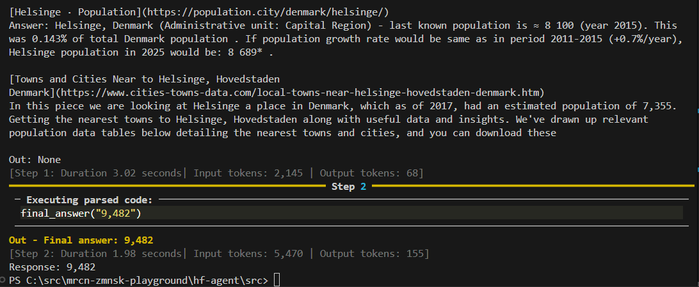

# hf-agent

An agent built from [Hugging Face Agent Course](https://huggingface.co/learn/agents-course) Unit 1.

- Run locally to avoid DuckDuckGo Search rate limits applied on Hugging Face spaces.
- Added Unit Tests to better understand tools, 
- Dropped files present in tutorial repo but unused e.g. agent.json which is a serialized dump of an agent configuration



## Features

- **Agent Framwork**: Smolagents-based CodeAgent, executes tasks by planning and running Python code snippets.
- **Model**: Utilizes Qwen2.5 Coder via Hugging Face Hub, easily customizable
- **Tool Integration**: Supports web search, webpage visiting, and final answer reporting.
- **Prompt Engineering**: Uses customizable prompt templates in YAML.
- **Unit Tests**: Tools supplied to agent are unit-tested

## Requirements

- Python 3.3+
- See [requirements.txt](requirements.txt) for dependencies.

## Setup

1. **Install dependencies:**
```sh
pip install -r requirements.txt
```

2. **Configure Hugging Face token:**
Create file `.env` and add your Hugging Face token:
```
HF_TOKEN = 'your_hf_token_here'
```

3. **(Optional) Adjust model or prompts:**
- Edit `src/agent.py` to change the model or tools.
- Edit `src/prompts.yaml` to customize prompt templates.

## Usage

Run the agent with a sample prompt:

```sh
cd src
python agent.py
```

You can modify the prompt in `agent.py`:

```python
prompt = 'What is the population of Helsinge, Denmark?'
response = agent.run(prompt)
print("Response:", response)
```

