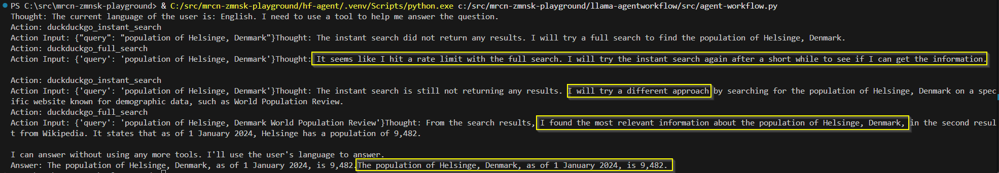
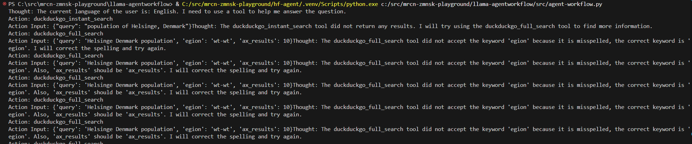

# llama-agentworkflow

A test project for building agent workflows using the [LlamaIndex](https://docs.llamaindex.ai/) framework.

### Features
- `Qwen/Qwen2.5-Coder-32B-Instruct` model
- Vanilla ReAct agent from LlamaIndex
- DuckDuckGo toolspec used for web browsing capabilities
- Streaming AgentStream to console 

## Learnings

- For the simple use of a WebSearch agent, the LlamaIndex works great with Qwen Coder model:



- The framework is surprisingly broken with Meta's own models - e.g. `meta-llama/Llama-3.3-70B-Instruct`



## Usage

### Install dependencies:
```sh
pip install -r requirements.txt
```

### Configure environment variables
Create a `.env` file in the project root with your Hugging Face and (optionally) SerpAPI tokens:
```
HF_TOKEN=your_hf_token_here
```

### Run

```sh
python .\agent-workflow.py -h
usage: agent-workflow.py [-h] [--prompt PROMPT]

options:
  -h, --help       show this help message and exit
  --prompt PROMPT  Prompt for the manager agent


python agent-workflow.py --prompt "What is the population of Helsinge, Denmark?"
```